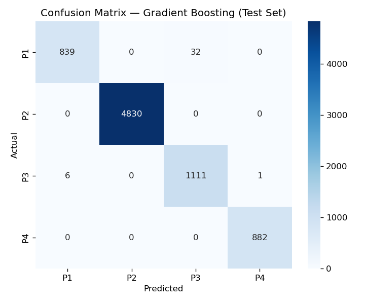
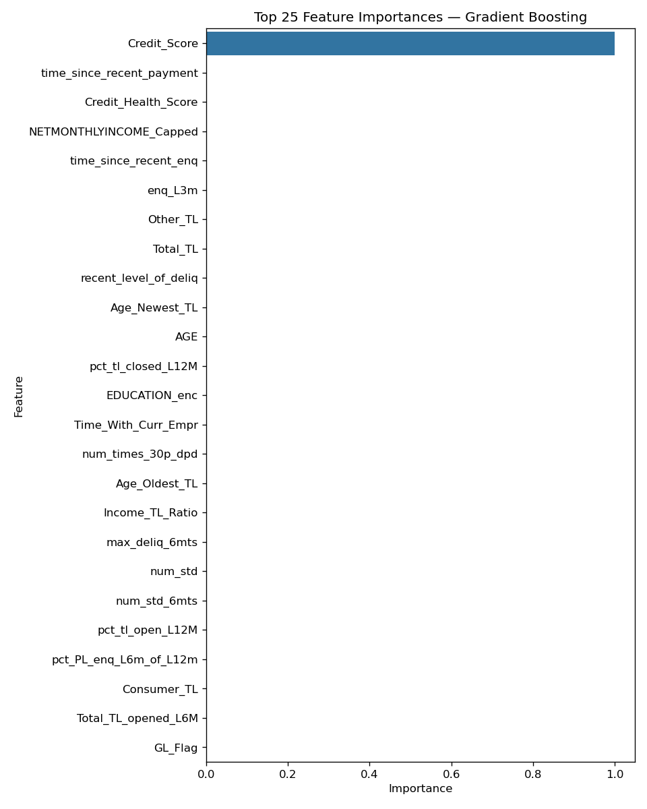

<div align="center">

# 🏦 FinRisk

### Credit Risk Assessment & Smart Loan Recommendation System

*Score loan applicants in real time — predict risk tiers, decide eligibility, calculate safe loan amounts with 30% FOIR guardrails, and project multi-year repayment schedules.*

[**🚀 Live Demo on Vercel**](https://fin-risk-credit-risk-and-loan-recom-five.vercel.app)

[](https://www.python.org/)
[](https://scikit-learn.org/)
[](https://flask.palletsprojects.com/)
[](https://pandas.pydata.org/)
[](https://fin-risk-credit-risk-and-loan-recom-five.vercel.app)
[](https://render.com)
[](https://fin-risk-credit-risk-and-loan-recom-five.vercel.app)

</div>

---

## 📌 Executive Summary

Financial institutions evaluate thousands of loan applications daily. Approving default-prone borrowers incurs direct capital loss, while rejecting creditworthy applicants loses revenue and market share. **FinRisk** bridges machine learning and credit risk underwriting to deliver fast, transparent, and explainable lending decisions.

Built on an end-to-end dataset of **51,336 applicants** combining internal bank case studies and external CIBIL credit bureau records, **FinRisk** answers four core questions for every applicant:

1. **How risky is the applicant?** → Gradient Boosting model classifies them into a risk tier (**P1** Best Risk to **P4** High Risk).
2. **Is the applicant eligible?** → Instant approval or decline with plain-English explanation of credit factors.
3. **How much can they safely borrow?** → Monotonic Random Forest Regressor calculates loan size bounded by real banking guardrails (keeping monthly EMI $\le 30\%$ of net monthly income).
4. **How will they repay the loan?** → Year-by-year amortization schedule with an interactive **Debt-Payoff Simulator**.

---

## 📸 Screenshots & Dashboard Walkthrough

### 📊 1. Overview — Loan Book & Portfolio KPIs
*Real-time summary of total scored applicants, eligible vs. rejected split, total loan book size, average loan size, and risk tier distribution.*


### 🎯 2. Live Prediction — Real-Time Scoring & Payoff Simulator
*Scores an applicant profile live, displaying decision verdict, confidence percentage, recommended loan, 30% FOIR ideal-zone indicator, and an interactive debt-payoff slider.*


### 📈 3. Portfolio Insights — Decision Curves & Exposure Analytics
*Examines credit-score cutoff decision curves (~650 threshold cliff), segment approval rates by income & age, and projected interest returns per risk tier.*


### 🧠 4. Model Evaluation — Performance Metrics & Feature Importance
*Out-of-sample test evaluation comparing classifiers and regressors, along with top predictive features and confusion matrix.*


<p align="center">
  
  
</p>

### ⚡ 5. Batch Scoring — High-Speed CSV/Excel Processing
*Upload a batch file of up to 2,000 applicants and process all rows in a single vectorized ML call, with full CSV export capabilities.*


---

## 🔥 Key Features & Financial Guardrails

| Feature | Description |
| :--- | :--- |
| 🛡️ **Gradient Boosting Risk Tiering** | Predicts risk tier (**P1–P4**) with **99.46% validation accuracy** and **0.989 macro F1-score**. |
| 💰 **Monotonic Loan Regressor** | **Random Forest Regressor ($R^2 = 0.958$)** enforces monotonic constraints so higher credit scores never result in smaller loan recommendations. |
| ⚖️ **30% FOIR Affordability Ceiling** | Enforces Fixed-Obligation-to-Income Ratio ($\text{EMI} \le 30\%$ of take-home income) to keep basic living needs and savings untouched. |
| 📊 **Composite Credit Health Score** | Custom 0–100 score combining CIBIL score, credit age, on-time payment ratio, penalizing missed payments and $30+$ days-past-due delinquencies. |
| 📉 **Risk-Adjusted Sizing Multiplier** | Dynamically scales down maximum loan capacity (0.6x to 1.0x) for applicants with weaker payment histories. |
| 🛑 **Minimum Viable Loan Gate** | Auto-declines applicants whose income cannot support a minimum ₹50,000 loan ticket size under the 30% FOIR rule. |
| 🚀 **Credit Score Upside Calculator** | Calculates exact additional loan amount an applicant would unlock if their score reaches the 750+ top credit band. |
| ⚡ **Vectorized Batch Processing** | Scores thousands of applicants simultaneously in milliseconds using vectorized matrix calls (`score_batch`). |
| ⚡ **Lazy Model Loading (`_LazyModel`)** | Keeps dashboard server startup instant by loading 69MB model objects into memory on first inference request. |

---

## 🏛️ Risk Tier Policy Matrix

| Risk Tier | Category | Status | Max Loan | Interest Rate | Max Tenure | Target Score Range |
| :---: | :---: | :---: | :---: | :---: | :---: | :---: |
| **P1** | Best Risk | Approved | ₹2,500,000 | 8.5% p.a. | 5 Years | 750+ |
| **P2** | Good Risk | Approved | ₹1,500,000 | 10.5% p.a. | 4 Years | 700 – 749 |
| **P3** | Moderate Risk | Conditional | ₹750,000 | 13.5% p.a. | 3 Years | 650 – 699 |
| **P4** | High Risk | Declined | ₹200,000 Cap | 18.0% p.a. | 2 Years | < 650 |

---

## 📊 Machine Learning Pipeline & Data Workflow

Everything is constructed across four modular Jupyter Notebooks running in logical sequence:

```
01_Data_Understanding.ipynb
 └── Merges Internal Bank Dataset + CIBIL Bureau Dataset on PROSPECTID (51,336 rows x 87 columns).

02_EDA_and_Feature_Engineering.ipynb
 └── Cleans missing sentinel values, winsorizes income outliers (1st/99th percentiles),
     prunes 19 redundant/high-null features via correlation (|r| > 0.9) & Chi-Square tests,
     and engineers Credit_Health_Score & Income_TL_Ratio.

03_Model_Training_Evaluation.ipynb
 └── Conducts stratified 70/15/15 train/validation/test splits. Benchmark classifiers
     (Gradient Boosting, Random Forest, Logistic Regression) & regressors (Random Forest, Linear).
     Trains monotonic Random Forest regressor and exports optimized .joblib models.

04_Loan_Recommendation_and_Repayment.ipynb
 └── Constructs precomputed fact tables (fact_LoanApplication.csv & fact_RepaymentSchedule.csv)
     combining model outputs, 30% FOIR rules, and multi-year amortization schedules.
```

---

## 🛠️ Tech Stack

* **Data & Machine Learning:** Python 3.11, Pandas, NumPy, Scikit-learn, SciPy, Joblib
* **Data Visualization:** Matplotlib, Seaborn
* **Web Backend & App:** Flask, Jinja2 Templates, Gunicorn
* **Frontend:** HTML5, Modern Vanilla CSS3 (Custom Design System, light bank-portal theme)
* **Automation & Testing:** Playwright (Headless UI capture & testing)
* **Deployment:** Vercel (Serverless Functions), Render (Web Service via `render.yaml`)

---

## 📁 Directory Structure

```
FinRisk-Bank Loan Prediction/
├── api/                      # Vercel serverless entrypoint (index.py)
├── dashboard/                # Flask Web Application
│   ├── app.py                # Route handlers (/predict, /batch, /insights, /customers, /model)
│   ├── pipeline.py           # Shared inference engine, vectorized scoring & rule logic
│   ├── static/               # CSS stylesheet, icons & payoff simulator JS
│   └── templates/            # Jinja2 HTML layout templates
├── data/
│   ├── raw/                  # Source datasets (Internal Bank + CIBIL Bureau)
│   └── processed/            # Cleaned featured dataset & precomputed fact tables
├── docs/screenshots/         # Application dashboard screenshots
├── figures/                  # Generated EDA & model evaluation charts
├── models/                   # Serialized ML models & encoders (.joblib)
├── notebooks/                # Notebooks 01 to 04 (End-to-end ML pipeline)
├── reports/                  # Model evaluation metrics, feature importances & EDA summaries
├── pyproject.toml
├── render.yaml               # Render deployment blueprint
├── requirements.txt          # Pinned Python dependencies
├── vercel.json               # Vercel routing configuration
└── README.md
```

---

## 🚀 Local Installation & Setup

```bash
# 1. Clone the repository
git clone https://github.com/AtharvDhiman/FinRisk-Credit-Risk-and-Loan-Recommendation.git
cd FinRisk-Credit-Risk-and-Loan-Recommendation

# 2. Create and activate a virtual environment
python -m venv venv
# On Windows:
venv\Scripts\activate
# On macOS/Linux:
source venv/bin/activate

# 3. Install dependencies
pip install -r requirements.txt

# 4. (Optional) Re-execute pipeline notebooks to regenerate data & models
jupyter nbconvert --to notebook --execute --inplace notebooks/01_Data_Understanding.ipynb
jupyter nbconvert --to notebook --execute --inplace notebooks/02_EDA_and_Feature_Engineering.ipynb
jupyter nbconvert --to notebook --execute --inplace notebooks/03_Model_Training_Evaluation.ipynb
jupyter nbconvert --to notebook --execute --inplace notebooks/04_Loan_Recommendation_and_Repayment.ipynb

# 5. Launch the Flask Dashboard
python dashboard/app.py
```

After starting the server, navigate to **`http://localhost:5000`** in your browser.

---

## 🌐 Live Deployment

* **Vercel (Production):** Accessible at [https://fin-risk-credit-risk-and-loan-recom-five.vercel.app](https://fin-risk-credit-risk-and-loan-recom-five.vercel.app)
* **Render (Blueprint):** Uses Gunicorn with 1 worker process bound to `$PORT` via `render.yaml`.

---

## 📝 Industry & Technical Perspective

The target risk tier in this case-study dataset is strongly correlated with CIBIL credit score bands, yielding high headline classification accuracy (99%+). In a production institutional deployment, underwriters predict **Probability of Default (PD)** from longitudinal repayment performance and validate models on **AUC-ROC**, **Gini Coefficient**, and **Kolmogorov-Smirnov (KS)** statistics. This project demonstrates a production-grade end-to-end data science workflow, risk rule integration, and interactive web deployment.

---

<div align="center">

**Built with Python, Scikit-learn & Flask** · Gradient Boosting Classifier + Monotonic Random Forest Regressor

</div>
