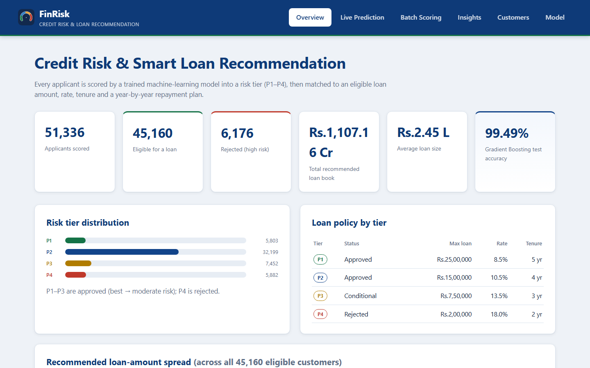
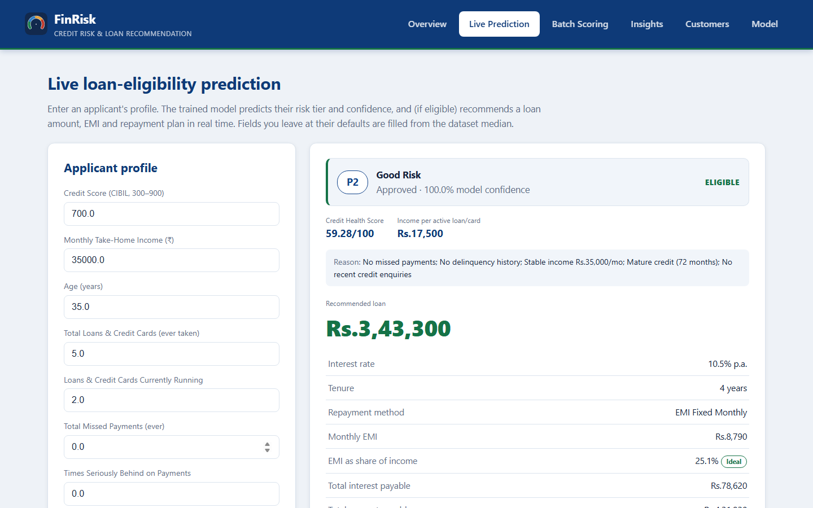
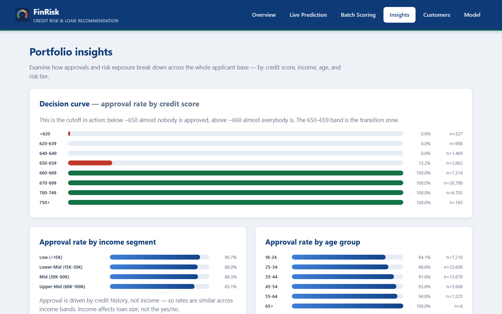
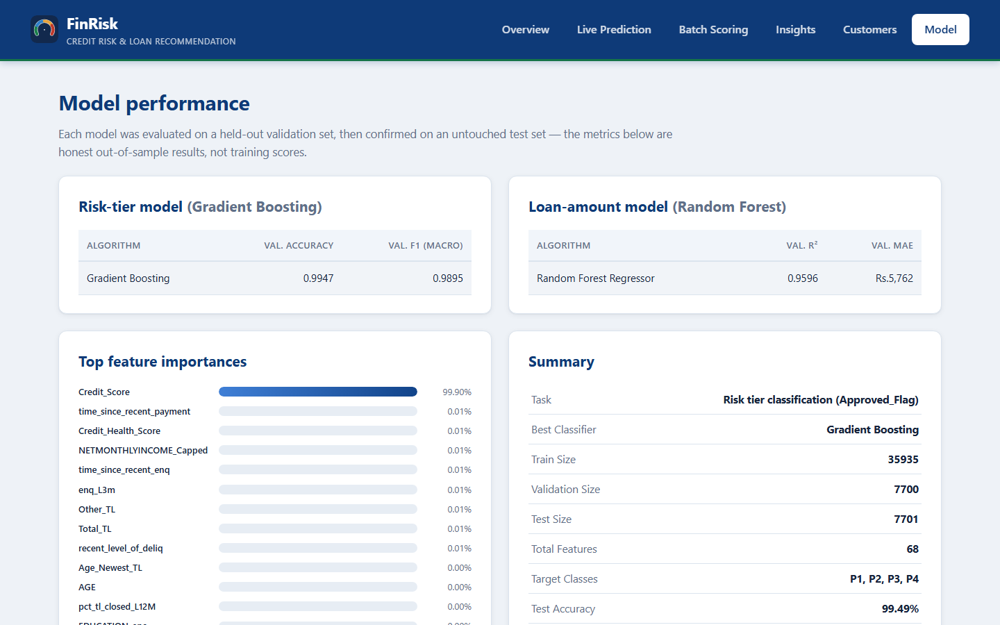
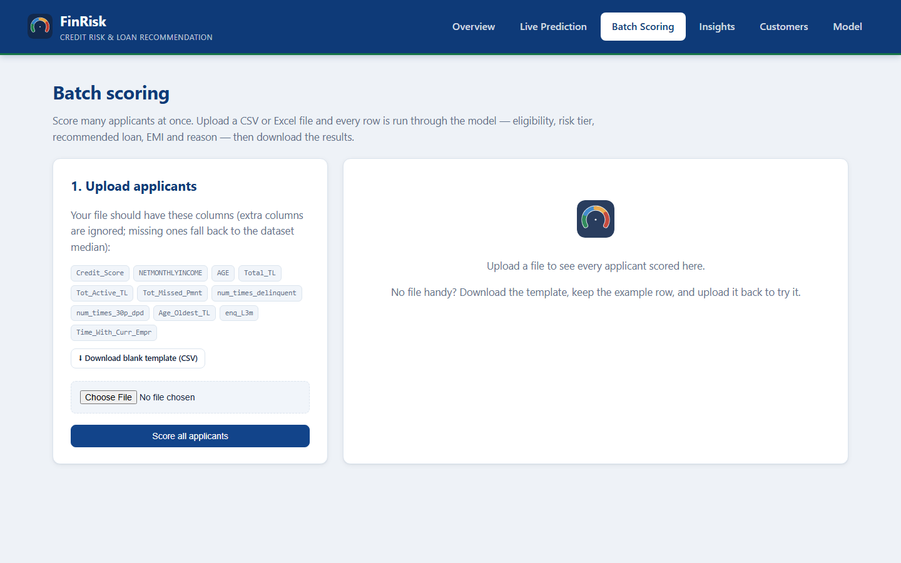

<div align="center">

#  FinRisk

### Credit Risk Assessment & Smart Loan Recommendation System

*Score a loan applicant in seconds — predict their risk, decide eligibility, recommend a safe loan amount, and project the year-by-year repayment — all from one dashboard.*


</div>

---

##  What is this?

Banks receive thousands of loan applications a day. Approving a risky borrower loses money; rejecting a good one loses business. **FinRisk** uses machine learning to make that decision fast, consistent, and explainable.

For any applicant it answers four questions:

1. **How risky are they?** → a trained model sorts them into a risk tier (P1 best → P4 high risk)
2. **Are they eligible?** → approve or reject, with a plain-English reason
3. **How much can they safely borrow?** → a loan amount sized so the EMI never eats more than **30% of income** (the "ideal zone"), scaled down for weaker credit history
4. **How will they repay it?** → a year-by-year schedule showing how much debt is cleared and how much is left

Built on the CIBIL bureau + internal-bank case-study dataset (**51,336 applicants**).

---

##  Screenshots

### Overview — the whole loan book at a glance
Portfolio KPIs, risk-tier split, and the spread of recommended loan sizes.



### Live Prediction — score one applicant in real time
Enter a profile → get the decision, confidence, recommended loan, EMI, an affordability check, a **model comparison** (see how every algorithm votes), and an interactive **debt-payoff simulator**.



### Insights — how approvals & risk break down
The credit-score decision curve (the ~650 cut-off in action), approval rates by income and age, and the bank's risk exposure + projected interest income per tier.



### Model — honest, out-of-sample performance
Four classifiers and two regressors compared, plus the feature-importance ranking and evaluation charts.



### Batch Scoring — score a whole file at once
Upload a CSV/Excel of applicants and download every decision, loan, and EMI.



---

##  Key Features

| Feature | What it does |
|---|---|
|  **ML risk tiering** | Gradient Boosting classifier predicts the P1–P4 risk tier (99%+ test accuracy) |
|  **ML loan sizing** | A Random Forest regressor recommends the loan amount, bounded by real lending rules |
|  **Affordability guard (FOIR)** | EMI is kept in the **≤30% ideal zone** so basic needs & savings stay untouched; weaker credit history → smaller loan |
|  **Year-by-year repayment** | See principal paid, interest paid, and debt remaining each year |
|  **Payoff simulator** | Drag the yearly payment and watch the payoff period and total interest change live |
|  **Model selector** | Switch between trained models and compare how each one decides the same applicant |
|  **Portfolio insights** | Decision curves, segment approval rates, and interest-income exposure |
|  **Batch scoring** | Score hundreds of applicants from one upload and export the results |
|  **Plain-language UI** | No banking jargon — labels anyone can read |

---

##  How it works (the machine learning)

Everything is built in four notebooks that run in order:

| Notebook | What it does |
|---|---|
| `01_Data_Understanding` | Loads & merges the internal-bank + CIBIL bureau datasets on `PROSPECTID` |
| `02_EDA_and_Feature_Engineering` | Handles missing-value sentinels, EDA, drops redundant columns via correlation, engineers `Credit_Health_Score` & `Income_TL_Ratio` |
| `03_Model_Training_Evaluation` | Stratified train/validation/test split; **compares 4 classifiers** (Logistic Regression, Decision Tree, Random Forest, Gradient Boosting) and **2 regressors** (Linear, Random Forest); saves the winners |
| `04_Loan_Recommendation_and_Repayment` | Turns model outputs into eligibility, recommended amount/rate/tenure/EMI, reasons, and the repayment schedule |

**Loan-sizing rule** — the recommended loan is the *smallest* of: income multiple, risk-tier cap, and the **ideal-zone affordability limit** (≤30% EMI, risk-adjusted by credit health). Applicants whose income can't support a minimum viable loan are declined — exactly how real lenders operate.

---

##  Tech Stack

**Python** · **pandas** / **numpy** (data) · **scikit-learn** (ML) · **matplotlib** / **seaborn** (charts) · **scipy** (stats) · **Flask** + Jinja2 + HTML/CSS (dashboard) · **Jupyter** (notebooks) · **openpyxl** (Excel I/O)

No heavy frameworks, no CDN — a clean, self-contained data-science + Flask stack.

---

##  Project Structure

```
FinRisk/
├── notebooks/        # 01–04: the full analysis & modeling pipeline
├── dashboard/        # Flask app (app.py, pipeline.py, templates/, static/)
├── data/raw/         # Source datasets (internal bank + CIBIL bureau)
├── figures/          # EDA & model-evaluation charts
├── reports/          # Model metrics, feature importance, EDA summary
├── docs/screenshots/ # Dashboard screenshots
├── requirements.txt
└── README.md
```

> Trained models and processed data are **gitignored** (they're large and regenerable). Running the notebooks recreates them.

---

##  Getting Started

```bash
# 1. Install dependencies
pip install -r requirements.txt

# 2. Run the notebooks in order (regenerates processed data + models)
jupyter nbconvert --to notebook --execute --inplace notebooks/01_Data_Understanding.ipynb
jupyter nbconvert --to notebook --execute --inplace notebooks/02_EDA_and_Feature_Engineering.ipynb
jupyter nbconvert --to notebook --execute --inplace notebooks/03_Model_Training_Evaluation.ipynb
jupyter nbconvert --to notebook --execute --inplace notebooks/04_Loan_Recommendation_and_Repayment.ipynb

# 3. Launch the dashboard
python dashboard/app.py
```

Then open **http://localhost:5000**.

---

##  An honest note

The risk tier in this public case-study dataset is largely defined by credit-score bands, so the headline accuracy is high partly because the target is nearly a function of one feature. In a real deployment you'd predict **probability of default** from actual repayment outcomes and validate on AUC/KS/Gini. This project is a strong, end-to-end **demonstration** of the data-science + product workflow, not a drop-in production underwriting engine.

---

<div align="center">

**Built with scikit-learn & Flask** · Gradient Boosting classifier + Random Forest regressor

</div>
